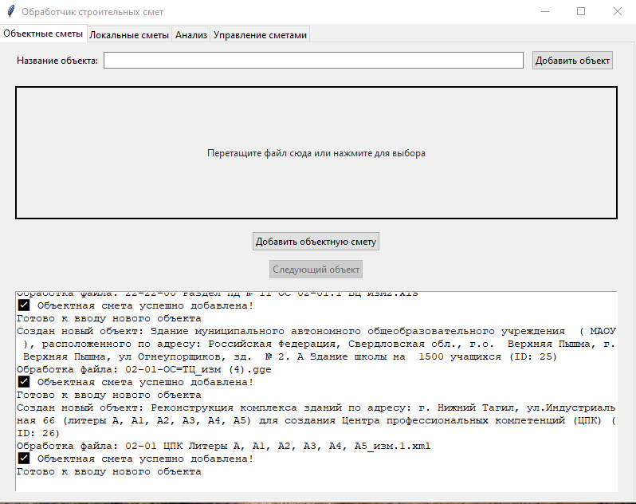
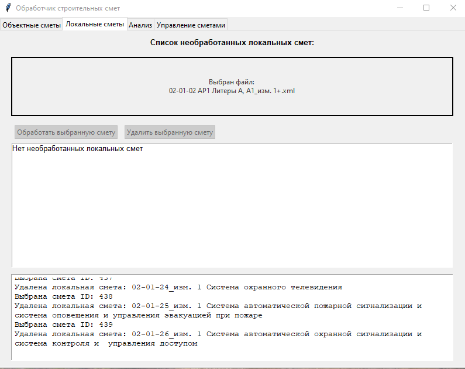
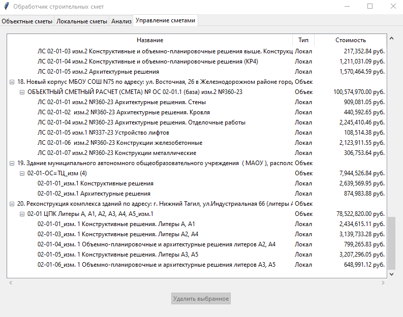

# Приложение для анализа строительных смет

Программа предназначена для загрузки, хранения и анализа строительных смет. Пользовательский интерфейс реализован на базе Tkinter и поддерживает загрузку смет в формате (для объектных смет: XML, XLS, XLSX, GGE и для локальных смет: XML). Данные сохраняются в PostgreSQL, а результаты анализа выводятся в виде Excel-отчетов.

---

## Скачать приложение

Скачать последнюю версию `.exe` (Windows): [Ссылка на релиз](https://example.com/release)

Открывается как обычное приложение для Windows `BuildCalc.exe`

---

## Основные возможности

- Загрузка **локальных** и **объектных** смет в различных форматах.
- Сохранение данных в базу PostgreSQL.
- Удобный графический интерфейс с 4 вкладками:
  - **Объектные сметы** — добавление новых объектов и загрузка смет.
  - **Локальные сметы** — загрузка смет, просмотр и удаление отдельных смет.
  - **Анализ** — генерация отчетов по выбранным объектам.
  - **Управление** — просмотр и удаление объектов и связанных смет.
- Генерация отчетов в Excel:
  - Частота вхождений работ и материалов.
  - Количество различных смет.
  - Удельная стоимость работ.
  - Процент АР/КР (архитектурно-строительный анализ).
- Образцы отчетов находятся в папке `sample_reports`.

---

## Скриншоты интерфейса

| Объектные сметы | Локальные сметы |
|------------------|------------------|
|  |  |

| Управление | Анализ |
|--------|-------------|
|  |  |


---

## Структура проекта

```
.
├── dump_database/           # SQL-дампы для создания и наполнения БД
│   ├── 1 clean_database/
│   ├── 2 test_filling_of_the_database/
│   └── 3 latest_data_database/
├── parsing/                 # Логика разбора смет
│   ├── object/              # Обработка объектных смет (XLS/XLSX/XML/GGE)
│   └── local/               # Парсинг локальных смет (XML)
├── models/                  # Модели таблиц и утилиты для БД
├── views/                   # Интерфейс на Tkinter (главный файл — `app.py`)
├── reports/                 # Скрипты генерации отчетов
├── sample_reports/          # Примеры готовых отчетов
├── config.py                # Конфигурация подключения к БД
├── main.py                  # Точка входа (запуск интерфейса)
└── requirements.txt         # Зависимости проекта
```

---

## Установка

1. **Клонируйте репозиторий:**

```bash
git clone https://github.com/Torentine/application_for_construction_estimates.git
cd application_for_construction_estimates
```

2. **Создайте виртуальное окружение:**

```bash
python -m venv venv
source venv/bin/activate      # для Linux/macOS
venv\Scripts\activate         # для Windows
```

3. **Обновить pip:**
```bash
python -m pip install --upgrade pip
```

4. **Установите зависимости:**

```bash
pip install -r requirements.txt
```

В проекте используются: `tkinterdnd2`, `pandas`, `SQLAlchemy`, `psycopg2`, `openpyxl`, `beautifulsoup4` и другие.

---

## Настройка базы данных

Откройте `config.py` и укажите параметры доступа к вашей БД PostgreSQL:

```python
DB_CONFIG = {
    "dbname": "postgres",
    "user": "postgres",
    "password": "qwerty123!",
    "host": "localhost",
    "port": "5432"
}
```

---

## Инициализация базы данных

Для создания структуры БД и наполнения тестовыми или реальными данными можно использовать SQL-файлы из папки `dump_database/`
Как пример через командную строку (можно например через DBeaver):

```bash
psql -U postgres -d ваша_бд -f dump_database/1\ clean_database/1\ dump_an_empty_db.sql
# при необходимости:
psql -U postgres -d ваша_бд -f dump_database/2\ test_filling_of_the_database/1\ dump_postgres_test_filling_of_the_db.sql
```

---

## Запуск программы

Из корневой папки выполните:

```bash
python main.py
```

Откроется графическое окно с четырьмя вкладками для загрузки, управления и анализа смет.

---

## Отчеты

Во вкладке **Анализ** доступны следующие типы отчетов:

- **Количество вхождений** — сколько раз встречаются работы/материалы во всех сметах, сортировка по общему количеству вхождений.
- **Количество смет** — в скольких сметах встречаются работы/материалы, сортировка по количеству смет.
- **Удельная стоимость** — сортировка по удельной стоимости работ/материалов.
- **АР/КР** — процент архитектурных и конструктивных работ.

Результаты сохраняются в формате `.xlsx`.

---

---

## Структура базы данных

Приложение использует PostgreSQL и хранит данные в нескольких связанных таблицах.  
Полную визуальную схему базы данных можно посмотреть по ссылке:

👉 [Посмотреть схему базы данных](https://app.database-design.ru/scheme/4476)

### Таблицы:

---

### 🏗️ `objects`

| Поле          | Тип              | Описание             |
|---------------|------------------|----------------------|
| `id`          | SERIAL           | Первичный ключ       |
| `object_name` | VARCHAR(1000)    | Наименование объекта |

---

### 📊 `object_estimates`

| Поле                   | Тип              | Описание                               |
|------------------------|------------------|----------------------------------------|
| `id`                   | SERIAL           | Первичный ключ                         |
| `object_id`            | INT              | ID объекта (внешний ключ на `objects`) |
| `name_object_estimate` | VARCHAR(1000)    | Название объектной сметы               |
| `object_estimates_price` | DECIMAL(12,2)  | Стоимость объектной сметы              |

---

### 📋 `local_estimates`

| Поле                    | Тип              | Описание                                          |
|-------------------------|------------------|--------------------------------------------------|
| `id`                    | SERIAL           | Первичный ключ                                   |
| `object_estimates_id`   | INT              | ID объектной сметы (внешний ключ на `object_estimates`) |
| `name_local_estimate`   | VARCHAR(1000)    | Название локальной сметы                         |
| `local_estimates_price` | DECIMAL(12,2)    | Стоимость локальной сметы                        |

---

### 📦 `sections`

| Поле          | Тип              | Описание                                             |
|---------------|------------------|------------------------------------------------------|
| `id`          | SERIAL           | Первичный ключ                                       |
| `estimate_id` | INT              | ID локальной сметы (внешний ключ на `local_estimates`) |
| `name_section`| VARCHAR(1000)    | Название раздела                                     |

---

### 🛠️ `work`

| Поле               | Тип              | Описание                                         |
|--------------------|------------------|--------------------------------------------------|
| `id`               | SERIAL           | Первичный ключ                                   |
| `local_section_id` | INT              | ID раздела (внешний ключ на `sections`)         |
| `code`             | VARCHAR(250)     | Код работы                                       |
| `name_work`        | VARCHAR(1000)    | Наименование работы                              |
| `price`            | DECIMAL(12,2)    | Стоимость                                        |
| `measurement_unit` | VARCHAR(250)     | Единица измерения                                |

---

### 🧱 `materials`

| Поле               | Тип              | Описание                                        |
|--------------------|------------------|-------------------------------------------------|
| `id`               | SERIAL           | Первичный ключ                                  |
| `work_id`          | INT              | ID работы (внешний ключ на `work`)              |
| `code`             | VARCHAR(250)     | Код материала                                   |
| `name_material`    | VARCHAR(1000)    | Наименование материала                          |
| `price`            | DECIMAL(12,2)    | Стоимость                                       |
| `measurement_unit` | VARCHAR(250)     | Единица измерения                               |

---


## Вклад в проект

1. Сделайте форк репозитория.
2. Создайте новую ветку: `git checkout -b feature/ваша_фича`.
3. Добавьте изменения и протестируйте.
4. Отправьте Pull Request.

---

## Контакты

Разработчик: [Torentine](https://github.com/Torentine)

Если нашли ошибку или хотите предложить улучшение — создайте issue или отправьте Pull Request.
