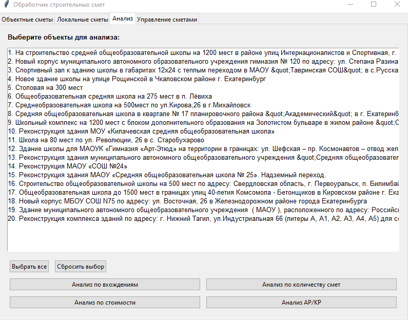

# Приложение для анализа строительных смет

Программа предназначена для загрузки, хранения и анализа строительных смет. Пользовательский интерфейс реализован на базе Tkinter и поддерживает загрузку смет в формате XML, XLS, XLSX и GGE. Данные сохраняются в PostgreSQL, а результаты анализа выводятся в виде Excel-отчетов.

---

## Скачать приложение

Скачать последнюю версию `.exe` (Windows): [Ссылка на релиз](https://example.com/release)

---

## Основные возможности

- Загрузка **локальных** и **объектных** смет в различных форматах.
- Сохранение данных в базу PostgreSQL.
- Удобный графический интерфейс с 4 вкладками:
  - **Объектные сметы** — добавление новых объектов и загрузка смет.
  - **Локальные сметы** — просмотр и удаление отдельных смет.
  - **Анализ** — генерация отчетов по выбранным объектам.
  - **Управление** — просмотр и удаление объектов и связанных смет.
- Генерация отчетов в Excel:
  - Частота вхождений работ и материалов.
  - Количество различных смет.
  - Удельная стоимость работ.
  - Процент АР/КР (архитектурно-строительный анализ).
- Образцы отчетов находятся в папке `sample_reports`.

---

## Скриншоты интерфейса

| Объектные сметы | Локальные сметы |
|------------------|------------------|
|  |  |

| Анализ | Управление |
|--------|-------------|
|  |  |


---

## Структура проекта

```
.
├── dump_database/           # SQL-дампы для создания и наполнения БД
│   ├── 1 clean_database/
│   ├── 2 test_filling_of_the_database/
│   └── 3 latest_data_database/
├── parsing/                 # Логика разбора смет
│   ├── object/              # Обработка объектных смет (XLS/XLSX/XML/GGE)
│   └── local/               # Парсинг локальных смет (XML)
├── models/                  # Модели таблиц и утилиты для БД
├── views/                   # Интерфейс на Tkinter (главный файл — `app.py`)
├── reports/                 # Скрипты генерации отчетов
├── sample_reports/          # Примеры готовых отчетов
├── config.py                # Конфигурация подключения к БД
├── main.py                  # Точка входа (запуск интерфейса)
└── requirements.txt         # Зависимости проекта
```

---

## Установка

1. **Клонируйте репозиторий:**

```bash
git clone https://github.com/Torentine/application_for_construction_estimates.git
cd application_for_construction_estimates
```

2. **Создайте виртуальное окружение:**

```bash
python -m venv venv
source venv/bin/activate      # для Linux/macOS
venv\Scripts\activate         # для Windows
```

3. **Установите зависимости:**

```bash
pip install -r requirements.txt
```

В проекте используются: `tkinterdnd2`, `pandas`, `SQLAlchemy`, `psycopg2`, `openpyxl`, `beautifulsoup4` и другие.

---

## Настройка базы данных

Откройте `config.py` и укажите параметры доступа к вашей БД PostgreSQL:

```python
DB_CONFIG = {
    "dbname": "postgres",
    "user": "postgres",
    "password": "qwerty123!",
    "host": "localhost",
    "port": "5432"
}
```

---

## Инициализация базы данных

Для создания структуры БД и наполнения тестовыми или реальными данными можно использовать SQL-файлы из папки `dump_database/`:

```bash
psql -U postgres -d ваша_бд -f dump_database/1\ clean_database/1\ dump_an_empty_db.sql
# при необходимости:
psql -U postgres -d ваша_бд -f dump_database/2\ test_filling_of_the_database/1\ dump_postgres_test_filling_of_the_db.sql
```

---

## Запуск программы

Из корневой папки выполните:

```bash
python main.py
```

Откроется графическое окно с четырьмя вкладками для загрузки, управления и анализа смет.

---

## Отчеты

Во вкладке **Анализ** доступны следующие типы отчетов:

- **Количество вхождений** — сколько раз встречаются работы/материалы.
- **Количество смет** — по каждому объекту.
- **Удельная стоимость** — стоимость единицы работы/материала.
- **АР/КР** — процент архитектурных и конструктивных работ.

Результаты сохраняются в формате `.xlsx`.

---

## Вклад в проект

1. Сделайте форк репозитория.
2. Создайте новую ветку: `git checkout -b feature/ваша_фича`.
3. Добавьте изменения и протестируйте.
4. Отправьте Pull Request.

---

## Контакты

Разработчик: [Torentine](https://github.com/Torentine)

Если нашли ошибку или хотите предложить улучшение — создайте issue или отправьте Pull Request.
